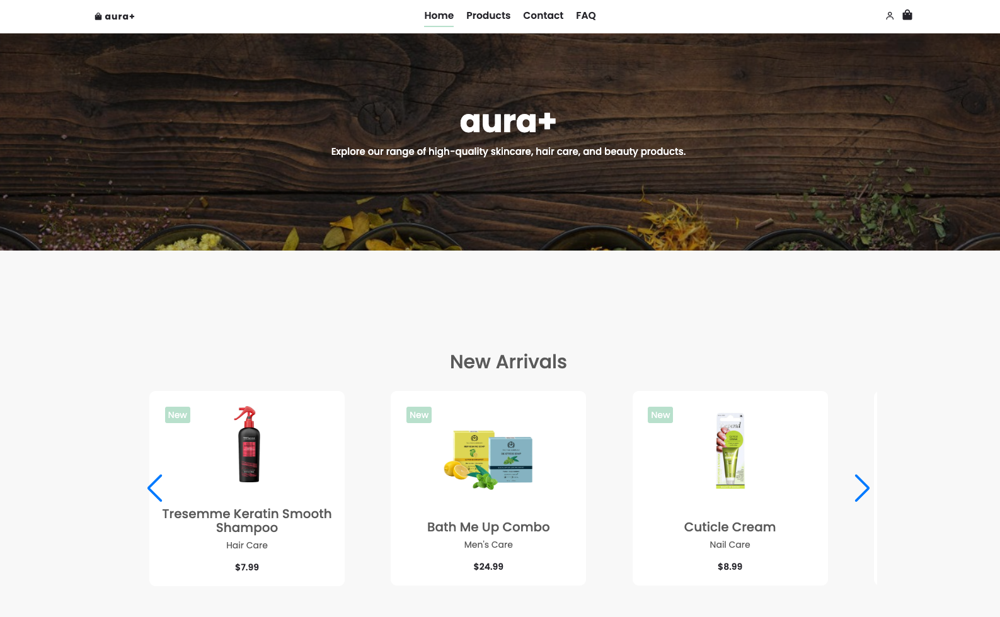
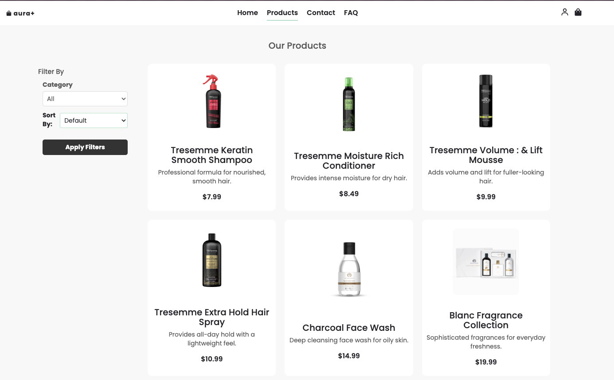

# Aura+ Skincare Website

A modern, responsive e-commerce website focused on skincare, haircare, and beauty products. This website provides a seamless shopping experience with a clean, user-friendly interface.

## Features

- **Responsive Design**: Fully responsive layout that works on mobile, tablet, and desktop devices
- **Product Showcase**: Interactive carousels for new arrivals and best sellers
- **User Authentication**: Secure login and signup functionality
- **Product Categories**: Organized sections for skincare, haircare, nail care, and men's care
- **Brand Showcase**: Featured brands carousel with descriptions
- **Shopping Cart**: Dynamic cart functionality with JavaScript
- **Contact Form**: User-friendly contact page
- **FAQ Section**: Comprehensive FAQ page for customer support

## Technologies Used

### Frontend
- **HTML5**: Structure and content
- **CSS3**: Styling and animations
- **JavaScript**: Interactive elements and dynamic content
- **Bootstrap 3.4.1**: Responsive grid system and UI components
- **Swiper.js**: Touch-enabled slider library for product carousels
- **Boxicons**: Modern icon library

### Backend
- **PHP**: Server-side scripting
- **MAMP**: Local development environment (MySQL, Apache, PHP)

### External Libraries
- **jQuery 3.7.1**: JavaScript library for DOM manipulation
- **Swiper**: Modern mobile touch slider

## Setup Instructions

1. **Prerequisites**:
   - Install MAMP (or equivalent local server environment)
   - Web browser (Chrome, Firefox, Safari, etc.)

2. **Installation**:
   - Clone this repository to your MAMP htdocs folder
   ```
   git clone https://github.com/yourusername/skinCareWebsite.git
   ```
   - Start MAMP server
   - Navigate to `http://localhost:8888/skinCareWebsite` in your browser (port may vary based on your MAMP configuration)

3. **Project Structure**:
   - `assets/`: Contains CSS, JavaScript, and image files
   - `*.php`: Main website pages
   - Various product category pages (skincare.php, haircare.php, etc.)

## Screenshots





## Future Enhancements

- Product search functionality
- User reviews and ratings
- Wishlist feature
- Payment gateway integration
- Admin dashboard for product management

## Contributors

- [Salman](https://github.com/salmxnz)
- [Zaheer](https://github.com/Zairrr22)
- [Jameel](https://github.com/Jameel1224)
- [Esha](https://github.com/cereal-killer22)
- [Urshita](https://github.com/urshiverse)

## License

This project is licensed under the MIT License - see the LICENSE file for details.
