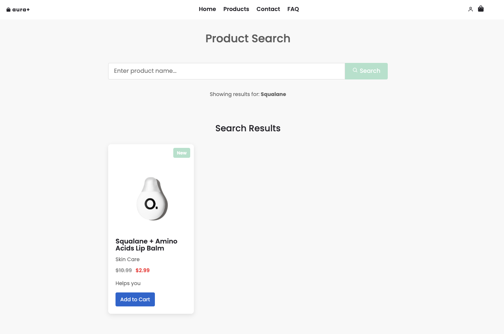
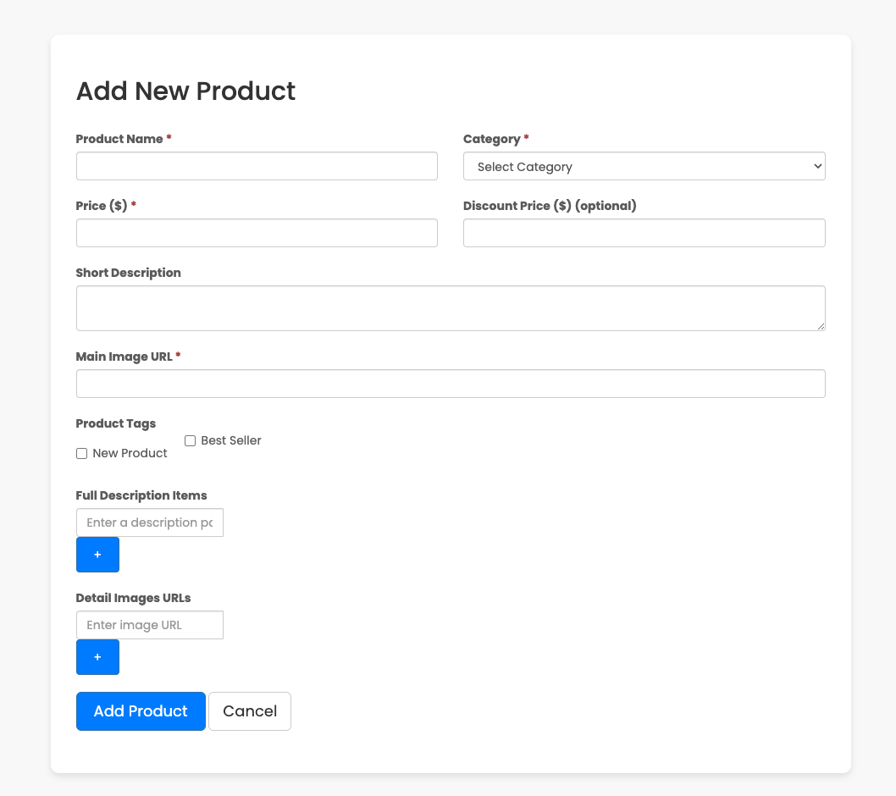
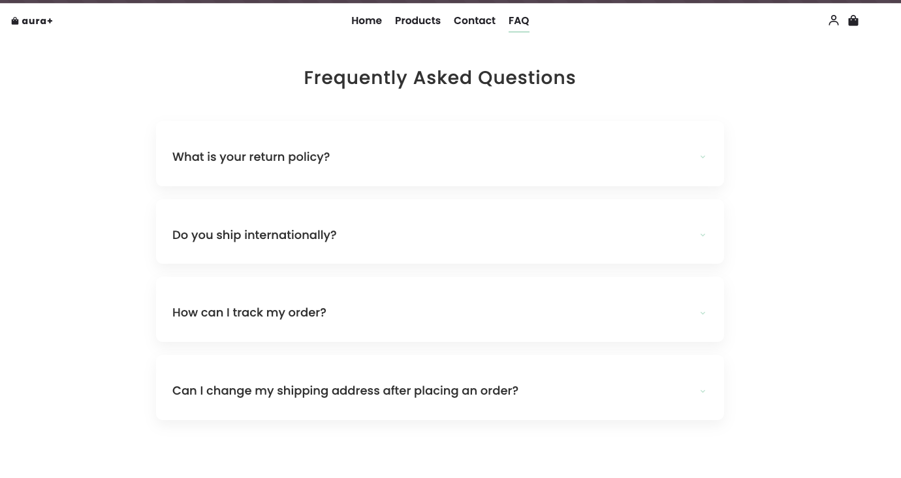
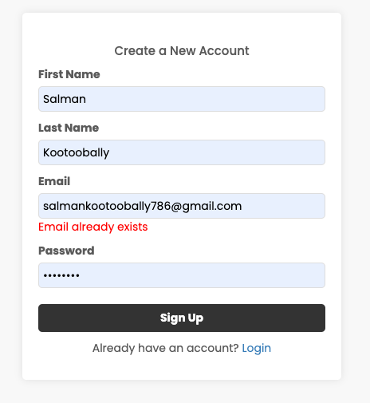
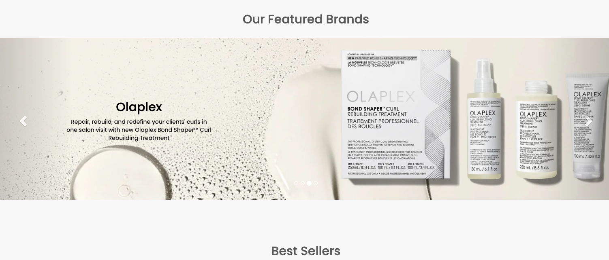
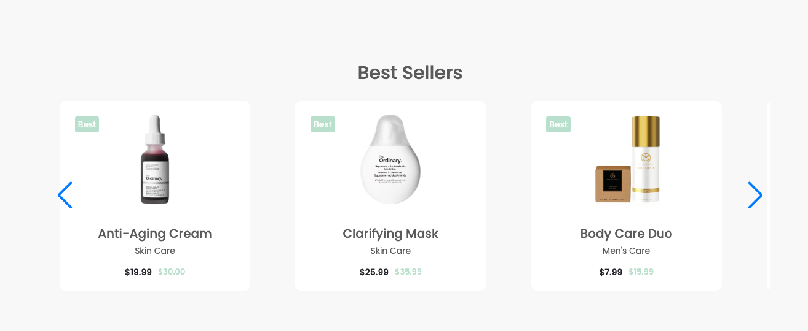
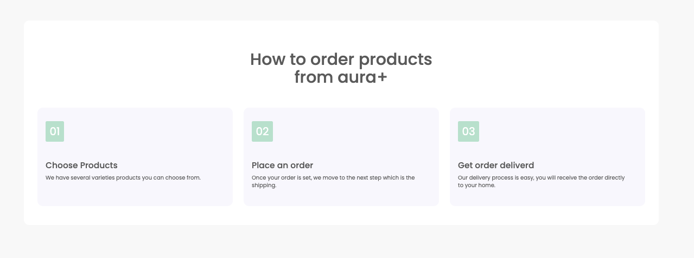

# Aura+ Skincare Website

A modern, responsive e-commerce website focused on skincare, haircare, and beauty products. This website provides a seamless shopping experience with a clean, user-friendly interface.

## Features

- **Responsive Design**: Fully responsive layout that works on mobile, tablet, and desktop devices
- **Product Showcase**: Interactive carousels for new arrivals and best sellers
- **User Authentication**: Secure login and signup functionality
- **Product Categories**: Organized sections for skincare, haircare, nail care, and men's care
- **Brand Showcase**: Featured brands carousel with descriptions
- **Shopping Cart**: Dynamic cart functionality with JavaScript
- **Product Search**: Advanced search functionality using SOAP web services
- **Contact Form**: User-friendly contact page
- **FAQ Section**: Comprehensive FAQ page for customer support

## Technologies Used

### Frontend
- **HTML5**: Structure and content
- **CSS3**: Styling and animations
- **JavaScript**: Interactive elements and dynamic content
- **Bootstrap 3.4.1**: Responsive grid system and UI components
- **Swiper.js**: Touch-enabled slider library for product carousels
- **Boxicons**: Modern icon library

### Backend
- **PHP**: Server-side scripting
- **MySQL**: Database management
- **SOAP**: Web service for product search functionality
- **XML/XSLT**: Data transformation and presentation
- **MAMP**: Local development environment (MySQL, Apache, PHP)

### External Libraries
- **jQuery 3.7.1**: JavaScript library for DOM manipulation
- **Swiper**: Modern mobile touch slider
- **NuSOAP**: PHP library for SOAP web services

## Database Structure

The website uses a MySQL database named `skincare_db` with the following tables:

### 1. Products Table
```sql
CREATE TABLE products (
    id INT AUTO_INCREMENT PRIMARY KEY,
    name VARCHAR(255) NOT NULL,
    category VARCHAR(100) NOT NULL,
    price DECIMAL(10,2) NOT NULL,
    discount_price DECIMAL(10,2) NULL,
    description TEXT,
    image VARCHAR(255),
    is_new TINYINT(1) DEFAULT 0,
    is_best TINYINT(1) DEFAULT 0
);
```

### 2. Product Description Items Table
```sql
CREATE TABLE product_description_items (
    id INT AUTO_INCREMENT PRIMARY KEY,
    product_id INT NOT NULL,
    title VARCHAR(255) NOT NULL,
    content TEXT,
    FOREIGN KEY (product_id) REFERENCES products(id) ON DELETE CASCADE
);
```

### 3. Product Options Table
```sql
CREATE TABLE product_options (
    id INT AUTO_INCREMENT PRIMARY KEY,
    product_id INT NOT NULL,
    option_name VARCHAR(100) NOT NULL,
    option_value VARCHAR(255) NOT NULL,
    price_modifier DECIMAL(10,2) DEFAULT 0.00,
    FOREIGN KEY (product_id) REFERENCES products(id) ON DELETE CASCADE
);
```

### 4. Product Detail Images Table
```sql
CREATE TABLE product_detail_images (
    id INT AUTO_INCREMENT PRIMARY KEY,
    product_id INT NOT NULL,
    image_url VARCHAR(255) NOT NULL,
    is_primary TINYINT(1) DEFAULT 0,
    FOREIGN KEY (product_id) REFERENCES products(id) ON DELETE CASCADE
);
```

### 5. Users Table
```sql
CREATE TABLE users (
    id INT AUTO_INCREMENT PRIMARY KEY,
    first_name VARCHAR(50) NOT NULL,
    last_name VARCHAR(50) NOT NULL,
    email VARCHAR(100) NOT NULL UNIQUE,
    password VARCHAR(255) NOT NULL,
    created_at TIMESTAMP DEFAULT CURRENT_TIMESTAMP,
    updated_at TIMESTAMP DEFAULT CURRENT_TIMESTAMP ON UPDATE CURRENT_TIMESTAMP
);
```

## Setup Instructions

1. **Prerequisites**:
   - Install MAMP (or equivalent local server environment)
   - Web browser (Chrome, Firefox, Safari, etc.)

2. **Installation**:
   - Clone this repository to your MAMP htdocs folder
   ```
   git clone https://github.com/yourusername/skinCareWebsite.git
   ```
   - Start MAMP server
   - Navigate to `http://localhost:8888/skinCareWebsite` in your browser (port may vary based on your MAMP configuration)

3. **Database Setup**:
   - The database connection is configured in `includes/db_connection.php`
   - Default configuration:
     - Server: localhost
     - Username: root
     - Password: root
     - Database: skincare_db
     - Port: 8889 (MAMP default)
   - To create the database tables and populate with sample data:
     - Navigate to `http://localhost:8888/skinCareWebsite/create_products_table.php`
     - This script will create the products table and add sample products
   - Additional setup scripts:
     - `create_product_description_items.php`: Creates and populates the product description items table
     - `create_product_options.php`: Creates and populates the product options table
     - `create_product_detail_images.php`: Creates and populates the product detail images table
     - `create_users_table.php`: Creates the users table

4. **Project Structure**:
   - `assets/`: Contains CSS, JavaScript, and image files
   - `includes/`: Contains reusable components and database connection
   - `data/xslt/`: Contains XSLT templates for XML transformation
   - `lib/`: Contains external libraries (NuSOAP)
   - `*.php`: Main website pages
   - Various product category pages (skincare.php, haircare.php, etc.)

## SOAP Web Service

The website implements a SOAP web service for product search functionality:

- **Server**: `server.php` - Defines the SOAP service and methods
- **Client**: `client.php` - Consumes the SOAP service
- **Search Interface**: `product_search.php` - User interface for searching products

To test the SOAP service:
1. Navigate to `http://localhost:8888/skinCareWebsite/test_soap.php`
2. This will test the connection to the SOAP service and display sample results

## Screenshots

### Home Page


### Shop Page


### Product Search


### Add Product


### FAQ Page


### Signup Page


### Additional Home Sections





## Future Enhancements

- User reviews and ratings
- Wishlist feature
- Payment gateway integration
- Admin dashboard for product management
- Enhanced search filters and sorting options

## Contributors

- [Salman](https://github.com/salmxnz)
- [Zaheer](https://github.com/Zairrr22)
- [Jameel](https://github.com/Jameel1224)
- [Esha](https://github.com/cereal-killer22)
- [Urshita](https://github.com/urshiverse)

## License

This project is licensed under the MIT License - see the LICENSE file for details.
